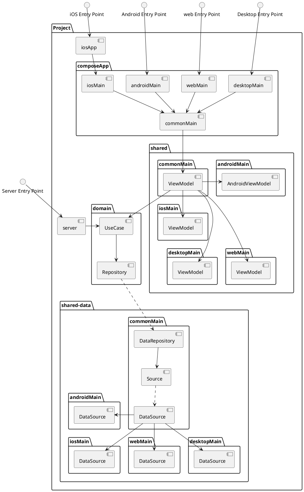

# Main Goal

The main goal of this project is to showcase how we
can integrate a Modularize structure following Fun 
Clean Architecture in Kotlin Multiplatform.

> This is not meant for one fit size solution for your
> application. 
> 
> This is meant for exploring modularization
> and showcasing Fun Clean Architecture in Kotlin Multiplatform.
> 
> It is better to evaluate your application before
> incorporating any architecture design.
{style="warning"}

## Expected Architecture when Finished

The goal is to create a design that is similar to the
diagram below:

