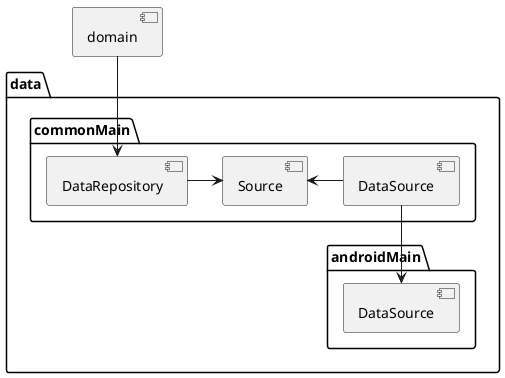

# androidMain

Contains platform-specific code for the Android platform within the data module.

## Expected Diagram Result

```plantuml
@startuml
component domain
folder data {
    folder commonMain {
        component DataRepository
        component Source
        component DataSource as common
    }
    folder androidMain {
        component DataSource as android
    }
}

DataRepository -> Source
Source <- common
common --> android

domain --> DataRepository

@enduml
```