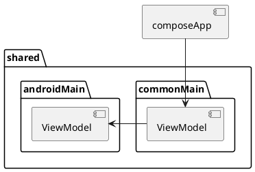

# androidMain

Contains platform-specific code for the Android platform within the shared module.

> Right now, there is nothing added here.
{style="note"}

## Expected Diagram Result

```plantuml
@startuml

component composeApp

folder shared {
    folder commonMain {
        component ViewModel as common
    }
    folder androidMain {
        component ViewModel as android
    }
}


composeApp --> common
common -> android

@enduml
```