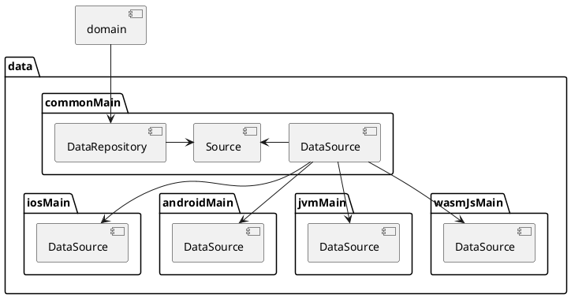

# commonMain

Houses platform-independent code that can be shared across all platforms (Android, iOS, Desktop, Web) 
within the data module.

## Expected Diagram Result

```plantuml
@startuml
component domain
folder data {
    folder commonMain {
        component DataRepository
        component Source
        component DataSource as common
    }
    folder iosMain {
        component DataSource as ios
    }
    folder androidMain {
        component DataSource as android
    }
    folder jvmMain {
        component DataSource as jvm
    }
    folder wasmJsMain {
        component DataSource as wasm
    }
}

DataRepository -> Source
Source <- common
common --> ios
common --> android
common --> jvm
common --> wasm
domain --> DataRepository

@enduml
```