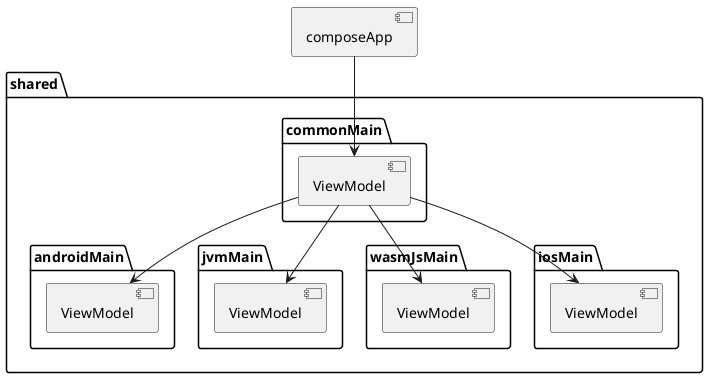

# commonMain

Houses platform-independent code that can be shared across all platforms (Android, iOS, Desktop, Web).

## Expected Diagram Result

```plantuml
@startuml

component composeApp

folder shared {
    folder commonMain {
        component ViewModel as common
    }
    folder androidMain {
        component ViewModel as android
    }
    folder jvmMain {
        component ViewModel as jvm
    }
    folder wasmJsMain {
        component ViewModel as wasmJs
    }
    folder iosMain {
        component ViewModel as ios
    }
}


composeApp --> common
common --> ios
common --> android
common --> jvm
common --> wasmJs

@enduml
```