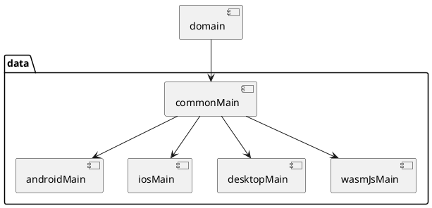

# data

The data layer manages the storage and retrieval of 
data within a system, acting as a bridge between the 
application's business logic and the underlying 
data storage mechanisms like databases or file systems. 

It includes components like database management systems, 
data access objects or repositories, ORM frameworks, 
caching mechanisms, and data validation logic. 

Its primary role is to ensure efficient and reliable 
data management while abstracting the complexities 
of data storage from the rest of the application.

## Sample Diagram in Kotlin Multiplatform

