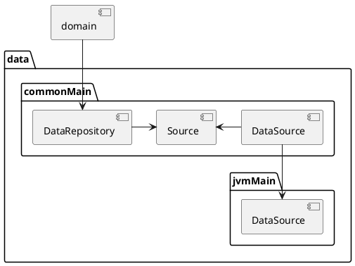

# jvmMain

Includes platform-specific code for the desktop within the data module.

```plantuml
@startuml
component domain
folder data {
    folder commonMain {
        component DataRepository
        component Source
        component DataSource as common
    }
    folder jvmMain {
        component DataSource as jvm
    }
}

DataRepository -> Source
Source <- common
common --> jvm
domain --> DataRepository

@enduml
```