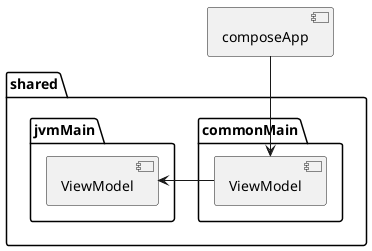

# jvmMain

Includes platform-specific code for desktop app within the shared module.

> Right now, there is nothing added here.
{style="note"}

## Expected Diagram Result

```plantuml
@startuml

component composeApp

folder shared {
    folder commonMain {
        component ViewModel as common
    }
    folder jvmMain {
        component ViewModel as desktop
    }
}


composeApp --> common
common -> desktop

@enduml
```