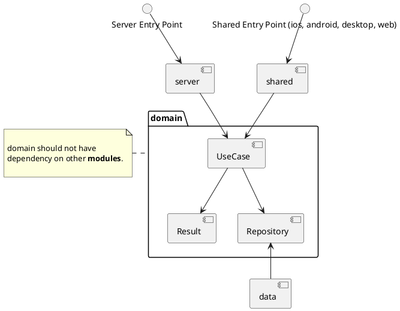

# domain

The domain layer, also known as the business logic layer, 
is a core component of software architecture that 
encapsulates the business rules, logic, and 
behaviors of a system. It represents the heart of 
the application, where the primary focus is on 
modeling and implementing the concepts and processes 
relevant to the problem domain.

In the domain layer, you'll find entities, which represent 
the key objects or concepts within the system, 
along with their attributes and relationships. 
Additionally, the domain layer often includes 
repositories or data access interfaces, 
defining how the application interacts with 
the underlying data storage.

One of the key principles of the domain layer is 
separation of concerns, aiming to keep business logic 
decoupled from other parts of the system such as user 
interface or infrastructure concerns. 

This separation promotes maintainability, 
testability, and flexibility in the software design.

Overall, the domain layer serves as the backbone of 
the application, providing a clear and organized 
representation of the business domain and enabling 
developers to implement and evolve complex business 
logic effectively.

## Sample Diagram in Kotlin Multiplatform

