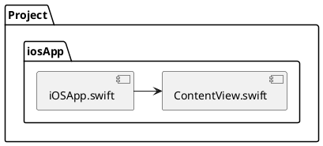

# iosApp

contains iOS applications. Even if you’re sharing your UI with Compose Multiplatform,
you need this entry point for your iOS app. This is also where you should add SwiftUI code for your project.

> Right now, we don't have anything special in the iosApp.
{style="note"}

