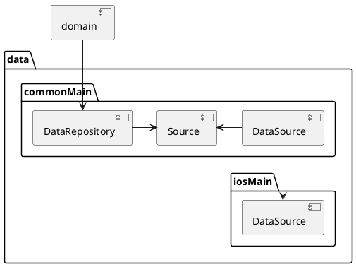

# iosMain

Holds platform-specific code for iOS within the data module.

## Expected Diagram Result

```plantuml
@startuml
component domain
folder data {
    folder commonMain {
        component DataRepository
        component Source
        component DataSource as common
    }
    folder iosMain {
        component DataSource as ios
    }
}

DataRepository -> Source
Source <- common
common --> ios

domain --> DataRepository
@enduml
```