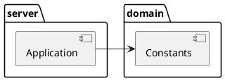

# server

`server module` is for the Ktor server application.

> Right now, we only need the constants value of the
> `domain module` into the `server module`.
>
> But in the future, we will add additional API in `server module `
> and business logic inside the `domain module`.
{style="note"}