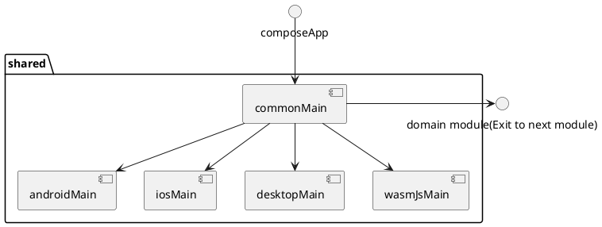

# shared

The shared module in Kotlin Multiplatform acts as 
the main entry point for the application, 
containing essential components like the ViewModel. 

While it includes the ViewModel, 
other key functionalities such as data management 
and business logic are abstracted into separate 
modules like Data and Domain. 

Additionally, the UI implementation is handled in a 
separate module called ComposeApp. 

This modular structure promotes organization, 
maintainability, and reusability across different 
platforms by separating concerns and allowing for 
platform-specific implementations when needed.

