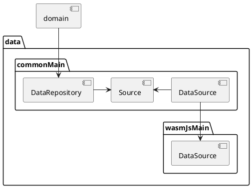

# wasmJsMain

Contains platform-specific code for Web within the data module.

```plantuml
@startuml
component domain
folder data {
    folder commonMain {
        component DataRepository
        component Source
        component DataSource as common
    }
    folder wasmJsMain {
        component DataSource as wasmJs
    }
}

DataRepository -> Source
Source <- common
common --> wasmJs
domain --> DataRepository

@enduml
```