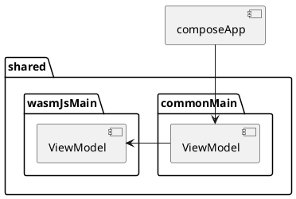

# wasmJsMain

Contains platform-specific code for web within the shared module.

> Right now, there is nothing added here.
{style="note"}

## Expected Diagram Result

```plantuml
@startuml

component composeApp

folder shared {
    folder commonMain {
        component ViewModel as common
    }
    folder wasmJsMain {
        component ViewModel as wasmJs
    }
}


composeApp --> common
common -> wasmJs

@enduml
```